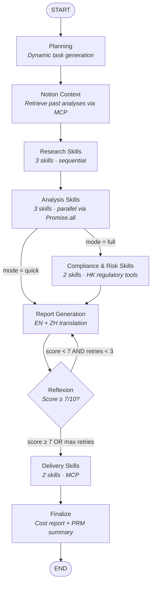

# AI Investment Analyst

Skill-composition investment intelligence platform — composable financial skills orchestrated by LangGraph.js, with a pluggable Skill Layer ([fin-intel-mcp](../fin-intel-mcp/)) for regulatory compliance, SEC filing RAG, and technical analysis.


## Architecture



## Skill Layer: fin-intel-mcp

The [Skill Layer](../fin-intel-mcp/) provides 9 composable MCP tools that any agent can consume — not coupled to this orchestrator:

| Skill | Description | Provider |
|-------|-------------|----------|
| `search_sec_filings` | Hybrid RAG search over SEC 10-K/10-Q/8-K filings | fin-intel-mcp |
| `search_earnings_calls` | RAG search over earnings call transcripts | fin-intel-mcp |
| `analyze_sentiment` | Financial sentiment analysis (FinBERT/LLM) | fin-intel-mcp |
| `get_technical_signals` | RSI, MACD, Bollinger Bands, Moving Averages | fin-intel-mcp |
| `ingest_document` | Fetch SEC filing → parse → chunk → embed → pgvector | fin-intel-mcp |
| `query_knowledge_base` | General RAG Q&A across all ingested documents | fin-intel-mcp |
| `check_hk_compliance` | HK regulatory requirements (HKMA, SFC, PDPO, HKEX) | fin-intel-mcp |
| `search_hkex_filings` | HKEX announcements and disclosure filings | fin-intel-mcp |
| `assess_cross_border_risk` | Cross-border regulatory risk (HK↔Mainland↔Intl) | fin-intel-mcp |

## Technical Highlights

**Skill Composition**
- **Compliance-as-Infrastructure** — regulatory rules (HKMA, SFC, PDPO) encoded as pluggable MCP skills, not hardcoded into agent prompts. Any MCP-compatible agent can consume them.
- **Reflexion** — structured self-improvement with memory across retries; 5-dimension rubric evaluation with root-cause analysis + action items
- **Process Reward Model** — step-level quality scoring after research, analysis, risk, and report phases
- **Dynamic Planning** — LLM generates execution plans at runtime, adapting research focus per company

**Engineering**
- **Turborepo Monorepo** — shared `@repo/core` analysis engine used by both CLI and web dashboard
- **Pipeline Visualization** — real-time DAG animation, execution log, PRM score badges, cost/token tracking
- **Next.js 15 Dashboard** — mobile-responsive UI with Supabase Auth, real-time report viewer, watchlist management
- **Live Data Verification** — real-time Yahoo Finance data appended as verified appendix
- **Parallel Execution** — Analysis domain runs 3 specialists concurrently via `Promise.all`, cutting latency ~3x
- **Multi-Market** — US stocks, HK stocks (.HK), A-shares (.SS/.SZ) with HK regulatory depth

## Tech Stack

| Layer | Technology |
|-------|-----------|
| **Frontend** | Next.js 15 (App Router), Tailwind CSS, react-markdown |
| **Pipeline Viz** | Custom SVG DAG, SSE streaming, real-time execution log |
| **Auth + DB** | Supabase (Postgres + Auth + RLS + Realtime) |
| **Orchestration** | LangGraph.js (state machine, conditional edges, checkpointer) |
| **Skills** | LangChain.js ReAct agents with tool binding |
| **Skill Layer** | [fin-intel-mcp](../fin-intel-mcp/) (Python/FastAPI/MCP) — 9 composable tools |
| **LLM** | DeepSeek-V3 (~$0.025/report), multi-provider routing |
| **Finance Data** | Yahoo Finance Chart API, SEC EDGAR (via MCP) |
| **HK Compliance** | HKMA, SFC, PDPO, HKEX rules database (via MCP) |
| **Delivery** | Notion API, Nodemailer, web dashboard |
| **Monorepo** | Turborepo (npm workspaces) |

## Quick Start

```bash
npm install

# ── Web Dashboard ──────────────────────────────────
npm run dev:web         # http://localhost:3000

# ── CLI ────────────────────────────────────────────
npm run demo            # Architecture showcase (no API keys)

cp .env.example .env    # Add DEEPSEEK_API_KEY
npm run start -- --company "NVIDIA" --mode full
npm run start -- --company "Apple" --mode quick

# Watchlist — analyze all 10 tracked companies
npm run watchlist       # full analysis
npm run watchlist:quick # quick mode
```

### Supabase Setup (for web dashboard)

1. Create a project at [supabase.com](https://supabase.com)
2. Run `packages/db/src/schema.sql` in Supabase SQL Editor
3. Create `apps/web/.env.local`:

```bash
NEXT_PUBLIC_SUPABASE_URL=https://your-project.supabase.co
NEXT_PUBLIC_SUPABASE_ANON_KEY=your-anon-key
DEEPSEEK_API_KEY=your-deepseek-key
```

### Notion + Email Setup (Optional)

Add to `.env` to enable auto-delivery:

```bash
NOTION_API_KEY=ntn_xxx
NOTION_DATABASE_ID=xxx
SMTP_HOST=smtp.gmail.com
SMTP_PORT=465
SMTP_USER=you@gmail.com
SMTP_PASS=your-gmail-app-password
EMAIL_TO=you@gmail.com
```

## Skill Domains

| Domain | Skills | Mode | Tools |
|--------|--------|------|-------|
| **Research** | Web Researcher, Data Collector, Synthesizer | Sequential | `web_search`, `news_search`, `competitor_search`, `get_stock_info`, `get_financial_history` |
| **Analysis** | Financial Analyst, Market Analyst, Tech Analyst | Parallel | `get_stock_info`, `get_financial_history`, `web_search`, `news_search` |
| **Compliance & Risk** | Risk Analyst, Compliance Analyst | Sequential | `web_search`, `news_search` + `check_hk_compliance`, `search_hkex_filings`, `assess_cross_border_risk` (MCP) |
| **Delivery** | Knowledge Manager, Distribution Coordinator | Sequential | `notion_save_analysis`, `gmail_send_report` (MCP) |

## Example: AMD Analysis (Live Run)

Full pipeline — planning, skill-domain research, Reflexion self-improvement loop, real-time Yahoo Finance data, Notion + email delivery.

```
Target: AMD
Mode: full
Started: 2026-03-11T08:17:25Z
-----------------------------------------------------------------
  [16:17:42] Dynamic plan created: 9 tasks
  [16:18:22] Research crew completed for AMD
  [16:18:25] Analysis crew completed (3 analysts ran in parallel)
  [16:18:31] Risk crew completed (score: 5)
  [16:19:11] Report generated (iteration 1)
  [16:19:38] Reflexion: score=5/10 (attempt 1), retry=true
  [16:20:41] Report generated (iteration 2)
  [16:21:05] Reflexion: score=5/10 (attempt 2), retry=true
  [16:22:06] Report generated (iteration 3)
  [16:22:44] Delivery: Notion saved, Email sent
  [16:22:44] Workflow completed. Final report ready.
```

| Metric | Value |
|--------|-------|
| **Company** | Advanced Micro Devices, Inc. |
| **Current Price** | $203.23 |
| **Market Cap** | $331.35B |
| **P/E Ratio (TTM)** | 78.17 |
| **Revenue (TTM)** | $34.64B |
| **Gross Margin** | 52.49% |
| **Risk Score** | 5/10 |
| **Recommendation** | HOLD |

*Full reports: [English](output/amd_report.md) · [中文](output/amd_report_zh.md)*

## Project Structure

```
ai-investment-analyst/
├── turbo.json                      # Turborepo config
├── package.json                    # Workspace root
├── packages/
│   ├── core/                       # Analysis engine (@repo/core)
│   │   └── src/
│   │       ├── engine.ts           # Main entry: runAnalysis()
│   │       ├── config.ts           # LLM & workflow config
│   │       ├── graph/              # LangGraph workflow + nodes
│   │       ├── crews/              # 4 skill domains: Research/Analysis/Compliance+Risk/Delivery
│   │       ├── agents/             # ReportWriter (EN + ZH)
│   │       ├── skills/             # Reflexion, PRM, Planner, CostTracker
│   │       ├── tools/              # Search, Finance, MCP tools
│   │       └── integrations/       # Notion API, email (SMTP)
│   └── db/                         # Database layer (@repo/db)
│       └── src/
│           ├── schema.sql          # Supabase schema (RLS enabled)
│           └── types.ts            # TypeScript DB types
├── apps/
│   ├── web/                        # Next.js 15 Dashboard (@repo/web)
│   │   └── src/
│   │       ├── app/
│   │       │   ├── dashboard/      # Main dashboard, reports, watchlist, settings
│   │       │   ├── (auth)/         # Login (Google OAuth + Magic Link)
│   │       │   └── api/analyze/    # Analysis trigger endpoint
│   │       ├── components/         # ReportViewer, WatchlistManager, etc.
│   │       ├── lib/                # Supabase client helpers
│   │       └── middleware.ts       # Auth guard
│   └── cli/                        # CLI tool (@repo/cli)
│       └── src/main.ts             # CLI entry point
└── output/                         # Generated reports (*.md)
```
